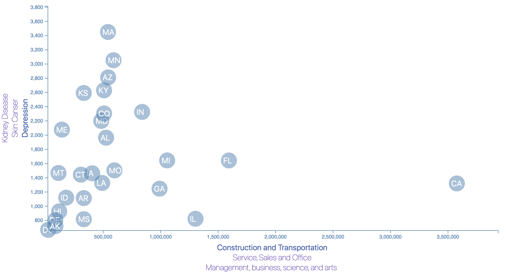

# Data Journalism and D3

Looking for demographic information using the 2014 one-year estimates from the U.S. Census Bureau's American Community Survey and 2014 survey data from the [Behavioral Risk Factor Surveillance System](https://chronicdata.cdc.gov/Behavioral-Risk-Factors/BRFSS-2014-Overall/5ra3-ixqq) built the D3 scatter plot to showcase the correlation between the occupation and various health risks:

